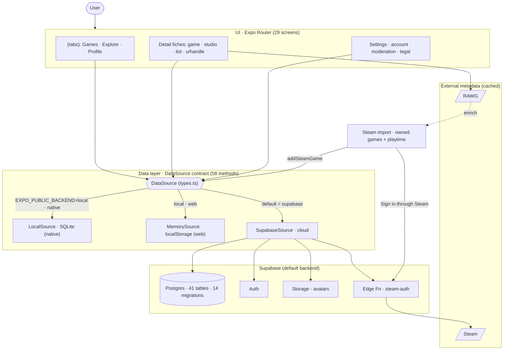

# GamerHoard — Living Knowledge Graph

> Auto-generated map of the codebase. Regenerate with `node docs/knowledge-graph/generate.mjs` (or `npm run graph`).
> Last generated: **2026-07-24T13:36:14.035Z**

Open **`graph.html`** in a browser for the interactive, clickable version. This file is the readable companion.

## What this app is (60-second orientation)

GamerHoard is a cross-platform (iOS / Android / web, one Expo Router codebase) video-game tracker — a fork of Watch Hoard repurposed from TV to games. You build a library of games, track their state (**Pendiente · Jugando · Pausado · Completado**), tick off **DLCs/expansions**, mark which **platforms** you own each game on, rate them and keep private notes. Metadata comes from **RAWG** (cached); the hero import is your **Steam** library (owned games + playtime), handled server-side by the `steam-auth` Edge Function.

**Inherited names, new meaning (read this or you WILL be confused):** GamerHoard keeps Watch Hoard's schema names to minimise churn. A **`show` / `tvdb_id` is a GAME** (RAWG id; Steam games use `2_000_000_000 + appid`), an **`episode` is a DLC/expansion**, **`network` is the studio/publisher**, and the `movie*` methods are largely legacy. `src/tmdb.ts` is a shim that re-exports `src/rawg.ts`.

**The one abstraction that matters:** every screen talks to a single `DataSource` interface (`apps/mobile/src/db/types.ts`, 58 methods). Three interchangeable implementations satisfy it — `LocalSource` (SQLite, native), `MemorySource` (localStorage, web), `SupabaseSource` (cloud). The active one is chosen at load time by `EXPO_PUBLIC_BACKEND` in `src/db/index.ts` (native) / `index.web.ts` (web); **cloud is the default and only an explicit `local` opts out.** **If you add a data operation, you implement it in all three.**

## At a glance

| Metric | Count |
| --- | --- |
| Screens (routes) | 29 |
| Layouts / special files | 4 |
| Source modules | 65 |
| DataSource methods | 58 |
| Supabase migrations | 14 |
| DB tables (created) | 41 |
| Edge Functions | 1 |
| External APIs | 4 |
| Languages (i18n) | 2 (641 keys) |
| Graph nodes / edges | 160 / 280 |

## Architecture

## Screens (Expo Router)

File-based routing under `apps/mobile/app/`. `(tabs)` is a layout group (not part of the URL). Some routes (`movie`, `episode`, `person`) are inherited from Watch Hoard and may be legacy.

| Route | File | What it is |
| --- | --- | --- |
| `/` | `(tabs)/index.tsx` |  |
| `/account` | `account.tsx` |  |
| `/badges` | `badges.tsx` |  |
| `/blocked` | `blocked.tsx` |  |
| `/calendar` | `calendar.tsx` |  |
| `/company/[id]` | `company/[id].tsx` |  |
| `/discover/[kind]/[id]` | `discover/[kind]/[id].tsx` |  |
| `/donate` | `donate.tsx` |  |
| `/episode/[key]` | `episode/[key].tsx` | Legacy episode route from the Watch Hoard base. |
| `/explore` | `(tabs)/explore.tsx` |  |
| `/follows` | `follows.tsx` |  |
| `/guidelines` | `guidelines.tsx` |  |
| `/history` | `history.tsx` |  |
| `/import` | `import.tsx` |  |
| `/language` | `language.tsx` |  |
| `/list/[id]` | `list/[id].tsx` |  |
| `/moderation` | `moderation.tsx` |  |
| `/movie/[id]` | `movie/[id].tsx` | Legacy movie route from the Watch Hoard base. |
| `/movies` | `(tabs)/movies.tsx` |  |
| `/notifications` | `notifications.tsx` |  |
| `/person/[id]` | `person/[id].tsx` |  |
| `/profile` | `(tabs)/profile.tsx` |  |
| `/requests` | `requests.tsx` |  |
| `/reset-password` | `reset-password.tsx` |  |
| `/settings` | `settings.tsx` |  |
| `/show/[id]` | `show/[id].tsx` |  |
| `/stats` | `stats.tsx` |  |
| `/tvtime-comments` | `tvtime-comments.tsx` |  |
| `/u/[handle]` | `u/[handle].tsx` |  |

## Source modules by area

### Data layer (`src/db/`) — the DataSource contract + backends

| Module | Purpose |
| --- | --- |
| `db/index.ts` | Native (iOS/Android) data source. |
| `db/index.web.ts` | Web data source. Never imports ./local (keeps expo-sqlite out of the web bundle). local (default) -> in-memory (MemorySource); supabase -> cloud (see ./supabase). |
| `db/local.ts` |  |
| `db/memory.ts` | Web / SSR fallback: same DataSource contract, backed by the seed JSON held in memory. |
| `db/schema.ts` | Local (on-device) SQLite schema — a pragmatic mirror of the Postgres schema in supabase/migrations. |
| `db/supabase.ts` |  |
| `db/types.ts` |  |

### Auth & session (`src/auth/`)

| Module | Purpose |
| --- | --- |
| `auth/AuthFlow.tsx` |  |
| `auth/AuthScreen.tsx` |  |
| `auth/Landing.tsx` |  |
| `auth/session.tsx` |  |
| `auth/Suspended.tsx` |  |

### In-app importer (`src/import/`)

| Module | Purpose |
| --- | --- |
| `import/csv.ts` | Small RFC4180-ish CSV parser (quotes only open at field start, like csv-parse's relax mode). |
| `import/parse.ts` | In-app port of packages/importer/src/parse.ts — same logic, but reads the CSVs from an in-memory map (basename → text) extracted from the user's GDPR zip. |
| `import/seed.ts` | In-app port of packages/importer/src/seed.ts + stats.ts — builds the Seed the data sources load, straight from the parsed export (no TMDB required; posters and genres are backfilled lazily by the a… |
| `import/zip.ts` | Minimal ZIP reader for the TV Time GDPR export — zero dependencies. |

### Feature logic (`src/*.ts`) — RAWG, Steam, social, ratings, stats…

| Module | Purpose |
| --- | --- |
| `categories.ts` |  |
| `data.ts` | Domain types (mirror the Postgres schema) + demo data. |
| `dates.ts` | Date-only helpers with LOCAL-day semantics. |
| `export.ts` |  |
| `genres.ts` | Library genre support: id<->name maps (localized) + lazy TMDB backfill of the `genres` column (comma-joined TMDB genre ids; '' = resolved but none/unknown). |
| `img.ts` | Placeholder poster while the real TMDB artwork loads/backfills: a neutral dark tile with the title's initial. |
| `moderation.ts` | Moderation & safety client (cloud only): user blocks, content reports, staff actions, account deletion. |
| `notifications.ts` | In-app announcements shown under the bell icon. |
| `posterSweep.ts` | One-shot bulk poster/genre resolver for freshly imported libraries. |
| `pwa.ts` | PWA install support. The `beforeinstallprompt` event fires ONCE early in the page life (Chromium only), so this module is imported for its side effect from _layout and stashes the event for the Set… |
| `ratings.ts` | External ratings, visible in the app (not just links). |
| `rawg.ts` | GamerHoard game-metadata client — reads from the RAWG Video Games Database (https://rawg.io/apidocs). |
| `social.ts` |  |
| `statsCard.ts` | Shareable stats card — renders a branded 1080x1350 PNG on an offscreen canvas (web only) and hands it to the Web Share API, falling back to a download. |
| `steam.ts` | Steam import for GamerHoard. |
| `supabase.ts` |  |
| `theme.ts` | GamerHoard design tokens — dark, cover-forward, cyan + violet accents (gaming vibe). |
| `tmdb.ts` | Compatibility shim. GamerHoard reads game data from RAWG; the real implementation lives in ./rawg.ts. This file keeps the historical import path (`../src/tmdb`) working so screens that haven't been… |
| `useData.ts` |  |

### UI components (`src/*.tsx`)

| Module | Purpose |
| --- | --- |
| `components.tsx` |  |
| `detail.tsx` | Shared building blocks for the game-detail screen (GamerHoard). |
| `DragScrollView.tsx` |  |
| `Fireworks.tsx` |  |
| `FriendsFeed.tsx` |  |
| `GameActionsModal.tsx` |  |
| `ListPickerModal.tsx` |  |
| `NextGameModal.tsx` |  |
| `NotificationBell.tsx` |  |
| `ReportSheet.tsx` |  |
| `ReviewsSection.tsx` |  |
| `ShareButton.tsx` |  |
| `Skeleton.tsx` |  |

### Low-level libs (`src/lib/`)

| Module | Purpose |
| --- | --- |
| `lib/authStorage.ts` |  |
| `lib/backend.ts` | Single source of truth for which DataSource + auth mode is active. |
| `lib/supabase.ts` |  |

### Internationalization (`src/i18n/`)

| Module | Purpose |
| --- | --- |
| `i18n/en.ts` | English translations (default language). |
| `i18n/es.ts` | Spanish translations. Typed as `Dict` (the shape of en.ts) so tsc flags any missing OR extra key versus English — this is our "nothing left behind" guard. |
| `i18n/index.ts` | i18next setup for Watch Hoard. |

### Shared package (`packages/core`)

| Module | Purpose |
| --- | --- |
| `core/src/index.ts` | Shared domain types + helpers used by the app, importer, and (future) API. |

### CLI importer (`packages/importer`)

| Module | Purpose |
| --- | --- |
| `importer/src/db.ts` | Upsert resolved catalog + a user's tracking into Supabase (service-role). |
| `importer/src/enrich.ts` | Enrich a seed with poster art. |
| `importer/src/meta.ts` | Enrich shows with TMDB status + total episodes + genres + network (for categories & stats). |
| `importer/src/parse.ts` |  |
| `importer/src/push.ts` | Push a local seed.json into the cloud app_* tables (0003) for one user. |
| `importer/src/run.ts` | Watch Hoard importer CLI. |
| `importer/src/seed.ts` | Build a compact, on-device seed from a TV Time export — no cloud, no TMDB required. |
| `importer/src/stats.ts` |  |
| `importer/src/tmdb.ts` | Minimal TMDB client. Resolves TheTVDB ids and movie titles -> TMDB posters/metadata. Auth: TMDB v4 read token (TMDB_ACCESS_TOKEN) or v3 key (TMDB_API_KEY). Disk-cached. |
| `importer/src/types.ts` | Normalized shapes the importer produces from a TV Time GDPR export. |

## The data contract (`DataSource`)

Every method must exist in all three backends. Coverage below is auto-checked against `local.ts` / `memory.ts` / `supabase.ts`. A `—` means the method looks missing in that backend — usually a bug or a deliberate no-op worth confirming.

Entity/row types: `Profile`, `ShowRow`, `RecentRow`, `MovieRow`, `ReviewRow`, `BadgeRow`, `ListRow`, `ListItemRow`, `AddShow`, `AddMovie`, `SteamGame`.

**Lifecycle & import**

| Method | Local | Memory | Supabase |
| --- | --- | --- | --- |
| `ready` | ✅ | ✅ | ✅ |
| `clearData` | ✅ | ✅ | ✅ |
| `reimport` | ✅ | ✅ | ✅ |
| `importData` | ✅ | ✅ | ✅ |

**Reads — library**

| Method | Local | Memory | Supabase |
| --- | --- | --- | --- |
| `getProfile` | ✅ | ✅ | ✅ |
| `getContinueWatching` | ✅ | ✅ | ✅ |
| `getShows` | ✅ | ✅ | ✅ |
| `getShowById` | ✅ | ✅ | ✅ |
| `getMovies` | ✅ | ✅ | ✅ |
| `getUpcomingMovies` | ✅ | ✅ | ✅ |
| `getMovieByUuid` | ✅ | ✅ | ✅ |
| `getReviews` | ✅ | ✅ | ✅ |
| `getBadges` | ✅ | ✅ | ✅ |
| `getFavorites` | ✅ | ✅ | ✅ |
| `getFavoriteMovies` | ✅ | ✅ | ✅ |
| `getRecent` | ✅ | ✅ | ✅ |

**Lists**

| Method | Local | Memory | Supabase |
| --- | --- | --- | --- |
| `getLists` | ✅ | ✅ | ✅ |
| `getListById` | ✅ | ✅ | ✅ |
| `getListItems` | ✅ | ✅ | ✅ |
| `createList` | ✅ | ✅ | ✅ |
| `renameList` | ✅ | ✅ | ✅ |
| `deleteList` | ✅ | ✅ | ✅ |
| `addToList` | ✅ | ✅ | ✅ |
| `removeFromList` | ✅ | ✅ | ✅ |

**Play state & progress (game / DLCs)**

| Method | Local | Memory | Supabase |
| --- | --- | --- | --- |
| `logRecent` | ✅ | ✅ | ✅ |
| `setShowState` | ✅ | ✅ | ✅ |
| `markWatched` | ✅ | ✅ | ✅ |
| `setProgress` | ✅ | ✅ | ✅ |
| `getWatchedEpisodes` | ✅ | ✅ | ✅ |
| `seedEpState` | ✅ | ✅ | ✅ |
| `setEpisodeWatched` | ✅ | ✅ | ✅ |
| `setShowNextAir` | ✅ | ✅ | ✅ |

**Replay**

| Method | Local | Memory | Supabase |
| --- | --- | --- | --- |
| `rewatchMovie` | ✅ | ✅ | ✅ |
| `rewatchEpisode` | ✅ | ✅ | ✅ |
| `getEpisodeRewatches` | ✅ | ✅ | ✅ |

**Library membership**

| Method | Local | Memory | Supabase |
| --- | --- | --- | --- |
| `addShow` | ✅ | ✅ | ✅ |
| `addMovie` | ✅ | ✅ | ✅ |
| `setMovieWatched` | ✅ | ✅ | ✅ |
| `removeShow` | ✅ | ✅ | ✅ |
| `removeMovie` | ✅ | ✅ | ✅ |
| `isShowInLibrary` | ✅ | ✅ | ✅ |
| `isMovieInLibrary` | ✅ | ✅ | ✅ |

**Metadata & posters**

| Method | Local | Memory | Supabase |
| --- | --- | --- | --- |
| `setShowMeta` | ✅ | ✅ | ✅ |
| `setShowPoster` | ✅ | ✅ | ✅ |
| `setShowGenres` | ✅ | ✅ | ✅ |
| `setMoviePoster` | ✅ | ✅ | ✅ |
| `setMovieGenres` | ✅ | ✅ | ✅ |
| `setMovieReleaseDate` | ✅ | ✅ | ✅ |
| `setMovieTmdbId` | ✅ | ✅ | ✅ |
| `getUncheckedPendientes` | ✅ | ✅ | ✅ |
| `markMovieChecked` | ✅ | ✅ | ✅ |

**Games — platforms · Steam · rating · notes**

| Method | Local | Memory | Supabase |
| --- | --- | --- | --- |
| `setOwnedPlatforms` | ✅ | ✅ | ✅ |
| `setPlatforms` | ✅ | ✅ | ✅ |
| `addSteamGame` | ✅ | ✅ | ✅ |
| `setShowRating` | ✅ | ✅ | ✅ |
| `setShowNotes` | ✅ | ✅ | ✅ |

**Favorites**

| Method | Local | Memory | Supabase |
| --- | --- | --- | --- |
| `setShowFavorite` | ✅ | ✅ | ✅ |
| `setMovieFavorite` | ✅ | ✅ | ✅ |

## Supabase Edge Functions

Server-side Deno functions under `supabase/functions/`. They hold secrets the client must never see (e.g. the Steam Web API key) and terminate third-party auth.

| Function | What it does |
| --- | --- |
| `steam-auth` | GamerHoard — Steam import backend. |

## Database migrations & tables

Applied in Supabase (cloud mode). `docs/supabase/APPLY_ALL.sql` bundles them. The on-device SQLite schema mirrors the `app_*` tables (see `src/db/schema.ts`). The GamerHoard-specific columns arrived in `0013` (`owned_platforms`, `platforms`, `playtime_minutes`, `steam_appid`) and `0014` (`user_rating`, `notes`).

| # | Migration | Creates tables | Functions / RPCs | Policies |
| --- | --- | --- | --- | --- |
| 0001 | `0001_init.sql` | profiles, shows, seasons, episodes, movies, characters, follows, watches, watchlist, ratings, emotion_votes, character_votes, comments, comment_likes, comment_translations, lists, list_items, friendships, activities, badge_awards, notifications, where_to_watch_votes, profile_settings, import_jobs, id_map |  |  |
| 0002 | `0002_rls.sql` | (alters profiles, shows, seasons, episodes, movies, characters, comments, list_items) |  | 15 |
| 0003 | `0003_app_user_data.sql` | app_profile, app_shows, app_ep_state, app_movies, app_reviews, app_badges, app_lists, app_recent |  | 1 |
| 0004 | `0004_accounts.sql` |  | is_handle_available, handle_new_user |  |
| 0005 | `0005_social_graph_and_reviews.sql` | user_follows, content_reviews, review_likes | follow_user, unfollow_user, respond_follow_request, follow_counts, bump_review_like | 7 |
| 0006 | `0006_favorites_and_list_items.sql` | app_list_items |  | 1 |
| 0007 | `0007_phase4_social_plus.sql` | activity_events |  | 7 |
| 0008 | `0008_movie_rewatch.sql` | (alters app_movies) |  |  |
| 0009 | `0009_recent_entity_and_movie_tmdb.sql` | (alters app_recent, app_movies) |  |  |
| 0010 | `0010_episode_rewatch.sql` | (alters app_ep_state) |  |  |
| 0011 | `0011_announcements.sql` | announcements |  | 1 |
| 0012 | `0012_moderation.sql` | user_blocks, reports | is_staff, is_banned, blocked_between, block_user, unblock_user, follow_user, submit_report, mod_resolve_report, mod_set_ban, admin_set_role, delete_account | 7 |
| 0013 | `0013_gamerhoard_game_fields.sql` | (alters app_shows) |  |  |
| 0014 | `0014_gamerhoard_rating_notes.sql` | (alters app_shows) |  |  |

## External APIs

| API | Host | Key? | Used by (modules) | Purpose |
| --- | --- | --- | --- | --- |
| RAWG | `api.rawg.io` | key | `rawg.ts` | Primary game metadata: games, DLCs, genres, platforms, stores (where to play), Metacritic, screenshots, similar. Free key. Cached (mem + disk, 24h). |
| Steam | `steampowered.com` | key | `import.tsx`, `steam.ts` | Library import (owned games + playtime) via the steam-auth Edge Function — "Sign in through Steam" (OpenID). Also store links + CDN header images. Key is a function secret, never in the client. |
| Supabase | `*.supabase.co` | key | `auth/session.tsx`, `lib/supabase.ts`, `steam.ts`, `supabase.ts`, `mod:packages/importer/src/db.ts`, `mod:packages/importer/src/push.ts` | Cloud backend: Postgres + Auth + Storage + Edge Functions. Default backend (cloud-first; login always required). |
| TMDB (legacy) | `image.tmdb.org` | key | `mod:packages/core/src/index.ts`, `mod:packages/importer/src/tmdb.ts` | Vestigial from Watch Hoard. src/tmdb.ts is a shim re-exporting rawg.ts; only the image-URL helper lingers in packages/core. |

## i18n & configuration

Languages: en (641 keys), es (641 keys). Default English; EN is the source of truth — other locales are typed against it so `tsc` catches missing keys. Add strings in `src/i18n/{en,es}.ts` and reference them with the t() helper.

Environment variables (names only; see `.env.example`): `EXPO_PUBLIC_BACKEND`, `EXPO_PUBLIC_RAWG_KEY`, `EXPO_PUBLIC_SUPABASE_ANON_KEY`, `EXPO_PUBLIC_SUPABASE_URL`, `SUPABASE_SERVICE_ROLE_KEY`, `SUPABASE_URL`, `TMDB_ACCESS_TOKEN`.

## Change recipes — "where do I edit X?"

**Add a new data operation (e.g. a new user action that persists):**
1. Add the method signature to the `DataSource` interface in `src/db/types.ts`.
2. Implement it in **all three** backends: `src/db/local.ts` (SQLite), `src/db/memory.ts` (localStorage snapshot map), `src/db/supabase.ts` (cloud).
3. If it needs a new column/table: add a guarded `alter table` in `LocalSource.ready()`, add/extend the localStorage map in `memory.ts`, and add a Supabase migration under `supabase/migrations/` (then regenerate `docs/supabase/APPLY_ALL.sql`). Follow the `0013`/`0014` pattern and degrade gracefully if the migration isn't applied yet. Bump the SQLite DB version / web storage key if the shape changes and a reseed is needed.
4. Call it from the screen. The coverage table above should show ✅✅✅ after — re-run the generator to confirm.

**Add a new screen:** create `apps/mobile/app/<route>.tsx` (or `app/<group>/[param].tsx` for dynamic). Expo Router picks it up by filename. Add nav from wherever it should be reachable, add its strings to i18n, and (if new route) it appears in the graph on regenerate. `.expo/types/router.d.ts` regenerates on `expo start -c`.

**Add a language:** create `src/i18n/<code>.ts` typed as the EN dict, register it in `src/i18n/index.ts` (`LANGS`, `resources`, `addResourceBundle`), and it shows up in the language picker.

**Add / change game metadata (RAWG):** work in `src/rawg.ts` (the RAWG client — cached, deduped). It intentionally keeps the old TMDB export names (`showDetails`, `detailsById`, …) so screens keep compiling; new code should prefer the game aliases (`gameImg`, `searchGames`, …). If you add a new fetched host, register it in the `API_SIGNS` array of `generate.mjs` so the graph tracks it.

**Touch the Steam import:** client flow is `src/steam.ts`; the actual API calls + secret live in the `supabase/functions/steam-auth` Edge Function. Never put the Steam Web API key in the client. Owned games become library rows via `addSteamGame` (`tvdb_id = STEAM_ID_OFFSET + appid`).

**Add a Supabase-only feature (social, moderation…):** write the migration (tables + RLS + `security definer` RPCs), mirror the client calls in `src/social.ts` / `src/moderation.ts`, gate the UI behind `isCloud` from `src/lib/backend.ts`. RLS must be enforcement-tested with a non-superuser role.

## Gotchas & landmines

- **Inherited names, new semantics.** `show`/`tvdb_id` = **game**, `episode`/`ep_state` = **DLC**, `network` = **studio/publisher**; `movie*` methods are mostly legacy. `src/tmdb.ts` re-exports `src/rawg.ts`. Grep results for "show"/"episode" are almost always about games/DLCs.
- **Three backends, one contract.** Forgetting one of `local`/`memory`/`supabase` is the most common bug. The coverage table catches it.
- **Cloud is the DEFAULT.** `src/lib/backend.ts` resolves to `supabase` unless `EXPO_PUBLIC_BACKEND=local`; login is always required. `app.config.js` bakes *public* defaults (Supabase URL + anon key + RAWG key) so CI/Cloudflare builds boot even with no `.env`. Never bake server secrets there.
- **Steam IDs are offset.** A Steam-imported game's library id is `STEAM_ID_OFFSET (2_000_000_000) + appid` to avoid clashing with RAWG ids. Use `isSteamId` / `appidOf` from `src/steam.ts`.
- **Steam import is server-side.** Default path is "Sign in through Steam" (OpenID) via the `steam-auth` Edge Function — no client key, no CORS proxy. `api.steampowered.com` sends no CORS headers, so never call it straight from web.
- **Web vs native split:** `src/db/index.ts` (native, SQLite) vs `src/db/index.web.ts` (web, Memory) keep `expo-sqlite` out of the web bundle. Never import `./local` from web code.
- **Root package.json scope drift.** The repo-root `package.json` still targets `@watchhoard/mobile` in its `mobile`/`web` scripts, but the app workspace is `@gamerhoard/mobile` — those root scripts won't resolve. Run from `apps/mobile` (`npx expo start`) or fix the workspace scope.
- **Secrets live in `.env` (gitignored), never the repo.** App reads `apps/mobile/.env` / the root `.env` (`EXPO_PUBLIC_*`); server scripts + the Edge Function read service/Steam secrets set out-of-band.
- **On this Cowork mount, git write commands can corrupt `.git`** — do git only on the real machine. A stale `.git/index.lock` sometimes lingers and blocks VS Code's git; delete it on the machine if git gets stuck.

## Curated notes

<!-- Hand-maintained. Edit CURATED.md; the generator injects it here verbatim. -->

> Hand-maintained durable knowledge that the generator can't read from code.
> Edit this file freely; `generate.mjs` injects it verbatim into `MAP.md`.

### North star & positioning
GamerHoard is a cross-platform **video-game tracker** — a fork of **Watch Hoard** repurposed from TV/movies to games. You build a library of games, set each one's state (**Pendiente · Jugando · Pausado · Completado**), tick off **DLCs/expansions**, record which **platforms** you own each game on, give it your own rating (1–10, shown as 5 stars) and private notes. Metadata comes from **RAWG** (https://rawg.io); the hero onboarding is importing your **Steam** library (owned games + hours played). See `GAMERHOARD.md` for the product tour (in Spanish).

### Inherited names, new semantics — the thing that trips everyone up
To minimise churn against the Watch Hoard base, GamerHoard **kept the old schema/method names** and gave them game meaning. Internalise this map or every grep result will mislead you:

| Code name | Actually means |
| --- | --- |
| `show` / `ShowRow` / `tvdb_id` | **a game** (id = RAWG id; Steam-imported games use `2_000_000_000 + appid`) |
| `episode` / `ep_state` / `watched_episodes` | **a DLC / expansion** (same checklist UI) |
| `network` | **studio / publisher** |
| `season` | **DLC group** |
| "where to watch" | **where to play** (stores: Steam, PSN, Xbox, GOG…) |
| TMDB rating | **Metacritic** (+ link-outs to OpenCritic, HowLongToBeat…) |
| `movie*` methods/routes, `person`, `episode/[key]` | **largely legacy** from Watch Hoard; games flow through the `show`/game paths |
| `src/tmdb.ts` | a **shim** that re-exports `src/rawg.ts` so old imports keep compiling |

New game code should prefer the friendly aliases at the bottom of `rawg.ts` (`gameImg`, `searchGames`, …) over the inherited TMDB-style names.

### Runtime modes (note: cloud is the DEFAULT here)
Unlike Watch Hoard, GamerHoard is **cloud-first**. `src/lib/backend.ts` resolves the backend to `supabase` **unless** `EXPO_PUBLIC_BACKEND=local` is set explicitly; **login is always required** either way.
- **Cloud (default)** → `SupabaseSource`. Accounts + library sync + the whole social/moderation layer.
- **Local opt-out** (`EXPO_PUBLIC_BACKEND=local`) → native = `LocalSource` (SQLite), web = `MemorySource` (localStorage). On-device, no cloud.
- `app.config.js` bakes **public** client defaults (Supabase URL + publishable anon key + RAWG key) so a build always boots — even with no `.env` (e.g. the Cloudflare CI build, where `.env` is gitignored). **Never** put server secrets (service_role, Steam key, etc.) there.

### Game states (the state machine)
`src/categories.ts` is the source of truth. Stored `state` → UI bucket:
- `backlog` → **not_started** (Pendiente)
- `watching` → **watching** (Jugando)
- `stopped` → **paused** (Pausado)
- `archived` → **finished** (Completado)

DLC completion drives the progress bar; a game with DLCs shows how many you own/finished, otherwise a half bar while playing.

### Steam import — the must-knows
Steam is the hero import (replaces Watch Hoard's TV Time import). It runs **server-side** through the `steam-auth` Supabase Edge Function so no Steam key or CORS proxy ever touches the client:
- **Default path:** "Sign in through Steam" (OpenID) — `importSteamLibrary()`. No key, no typing. Needs the user's Steam **"Game details" privacy = Public**.
- **Fallback (private profiles):** `importSteamManual()` — the user pastes their own Steam Web API key + profile; a key can read its owner's library even when private. The key is sent to the function once, never stored server-side.
- **ID offset:** a Steam game's library id = `STEAM_ID_OFFSET (2_000_000_000) + appid` to avoid clashing with RAWG ids. Use `isSteamId` / `appidOf` from `src/steam.ts`.
- **State from playtime:** never played → `backlog`; played in the last 90 days → `watching`; older → `stopped`.
- **CORS:** `api.steampowered.com` sends no CORS headers — never call it straight from web; that's why the Edge Function exists.
- **Function secrets** (set out-of-band, not in `.env`): `STEAM_WEB_API_KEY` (https://steamcommunity.com/dev/apikey), `STEAM_AUTH_SECRET` (HMAC-signs the SteamID between login and fetch), optional `STEAM_ALLOWED_HOSTS` (allowed web redirect hosts).

### RAWG client (`src/rawg.ts`)
Read-only, in-flight deduped, two-tier cache (L1 memory → L2 AsyncStorage/IndexedDB, 24h TTL), 12s timeout. Base `https://api.rawg.io/api`, key from `EXPO_PUBLIC_RAWG_KEY`. Keeps the old TMDB export names on purpose so screens keep compiling; remaps semantics to games (see the table above).

### Database
Supabase Postgres (cloud). `docs/supabase/APPLY_ALL.sql` bundles every migration for the SQL Editor; individual migrations live in `supabase/migrations/`. The GamerHoard-specific columns were added late on `app_shows`:
- **0013** — `owned_platforms`, `platforms`, `playtime_minutes`, `steam_appid`
- **0014** — `user_rating`, `notes`

New Supabase methods (`setOwnedPlatforms`, `setPlatforms`, `addSteamGame`, `setShowRating`, `setShowNotes`) degrade gracefully if 0013/0014 aren't applied yet. The on-device SQLite schema mirrors the `app_*` tables (`src/db/schema.ts`), with guarded `alter table`s in `LocalSource.ready()`.

### Deploy / infra
- **Web deploy = Cloudflare Worker** (source: repo-root `deployment info`):
  - Build: `cd apps/mobile && npx expo export -p web`
  - Deploy (production): `cd apps/mobile && npx wrangler deploy`
  - Non-production branch: `npx wrangler versions upload`
  - `apps/mobile/wrangler.jsonc` holds the Worker config; keep the SPA fallback on or deep links 404.
- **Run locally:** `cd apps/mobile && npx expo start -c`, then press `w` (web) / `a` (Android) / `i` (iOS) — see `execinstructions.txt`. Always run from `apps/mobile`; the repo-root `npm` scripts still point at the old `@watchhoard/*` scope.
- Supabase project ref baked into `app.config.js` public defaults: `jfbvovwrmpenrbnqauxt` (URL + publishable anon key are client-safe; RLS protects data). `STEAM_ALLOWED_HOSTS` example references `gamerhoard.pages.dev`.

### Landmines
- **Root `package.json` scope drift.** The repo-root manifest still names `@watchhoard/mobile` in its `mobile`/`web` scripts, but the app workspace is `@gamerhoard/mobile` — so those root scripts won't resolve. Run from `apps/mobile` (`npx expo start`) or fix the workspace scope. (`packages/core` and `packages/importer` are also still `@watchhoard/*`.)
- **Three backends, one contract.** Any `DataSource` method must be implemented in `local.ts`, `memory.ts`, **and** `supabase.ts`. The coverage table in `MAP.md` catches a miss.
- **Web vs native split.** `src/db/index.ts` (native/SQLite) vs `src/db/index.web.ts` (web/Memory) keep `expo-sqlite` out of the web bundle. Never import `./local` from web code.
- **Git only on the real machine.** The Cowork mount can corrupt `.git` on write; a stale `.git/index.lock` sometimes lingers and blocks VS Code's git — delete it on the machine if git gets stuck.
- **Secrets in `.env` (gitignored), never the repo.** Client reads `EXPO_PUBLIC_*`; server scripts / the Edge Function read service + Steam secrets set out-of-band.

### The deep-dive docs (read these for detail)
- `docs/Watch-Hoard_TV-Time-Successor-Plan.md`, `docs/WatchHoard_Engineering-Spec_DataModel-Import-UI.md` — inherited strategy + data model / import mapping (Watch Hoard context).
- `docs/CONNECT-SUPABASE.md`, `docs/PHASE3.md`, `docs/PHASE4.md`, `docs/AUDIT-2026-07-09.md`, `docs/LOCAL.md`, `docs/IMPORT-VALIDATION.md`.
- `docs/supabase/APPLY_ALL.sql` — all migrations bundled for the SQL Editor.
- `supabase/functions/steam-auth/README.md` — the Steam auth function contract.

### Open decisions / to confirm
Confirm the deploy target + domain from `deployment info`; decide whether to fix the `@watchhoard/*` → `@gamerhoard/*` scope drift in the root/packages manifests; games achievements + a releases calendar are noted as pending in `GAMERHOARD.md`.

---

_This map is generated. Don't edit it by hand — edit `CURATED.md` for durable notes, or the code itself, then run `node docs/knowledge-graph/generate.mjs`._
